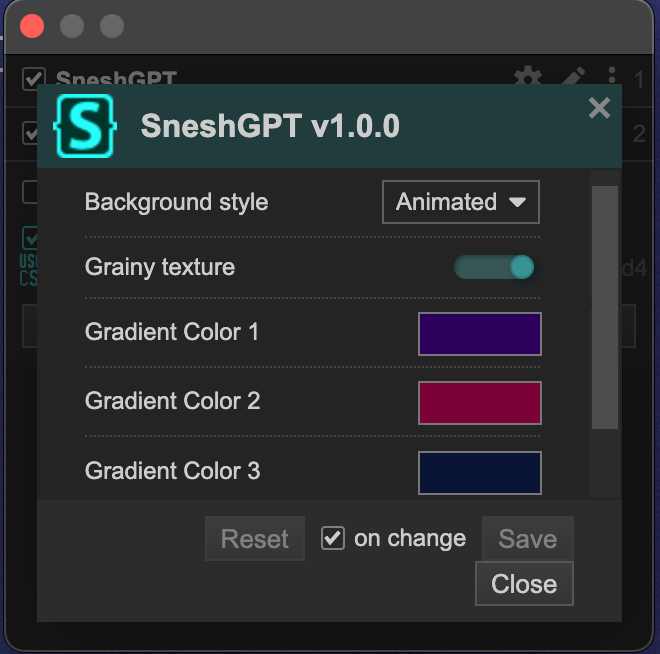

# SneshGPT 

This is the second in a - hopefully short - series of ""design"" projects. 

## Visuals 

This ChatGPT interface is prettier and comes with your own customized quick reply options. You can customize them by changing the first lines in the [SneshGPT_quickreplies.user.js](https://github.com/senshastic/sensha-betterer-todoist/raw/refs/heads/main/js/SneshGPT_quickreplies.user.js) file.
These replies can be different based on whether or not ChatGPT sent you code. You can also continue writing in the bar after it was pre-filled with one of your automated answers, so you can explain your problem in more details. 

It also has a pretty acrylic automatically sliding sidebar, which is neat. 

If you do not like the gradient or you are like me and you like changing colors all the time, you can change the colors directly through Stylus' UI. It's pretty neat and instantaneous. I also added a toggle for the grainy texture and the font now comes with three options: 
- Animated gradient (default)
- Static gradient
- No gradient
  

### Installation 

You should use the Dark Theme in ChatGPT - so all the letters go white and not black. 

Install the css using Stylus

-   [Firefox](https://addons.mozilla.org/en-US/firefox/addon/styl-us/)
-   [Chrome](https://chromewebstore.google.com/detail/stylus/clngdbkpkpeebahjckkjfobafhncgmne)

Once you have Stylus, you can install it directly clicking here: 

Install the js scripts using whatever people use to manage userscripts. I used [ViolentMonkey](https://violentmonkey.github.io/) because that's what Fallen used. Can be done by clicking here: 

- Quickreplies: 

- Sidebar:

### Fonts 

I made an add on that changes some of the fonts and colors of the interface. These changes are somewhat minor, but if you'd like to install them, you can find the add-on here: 

You must have the following fonts installed on your computer: 

- CC Wild Words
- Comic Code

If you don't have them, only the colors of the code blocks will change, which is already pretty nice imo. 

### Credits 

[Fallen](https://github.com/FallenStar08) - I do be loving doing things with you. 

